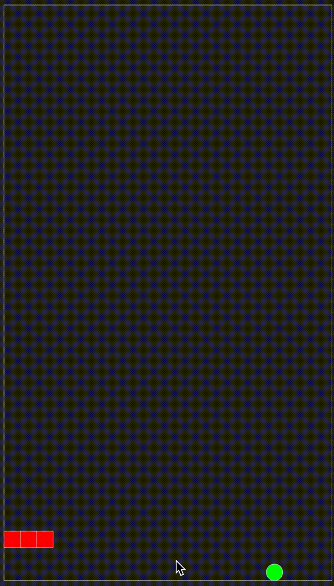

## Swake
_A Snake Game Implemented in Swift_

### Motivation

I wanted to give the "Game View" approach, as described in Game Coding Complete, a try on a very simple and straightforward project. The game logic is graphics agnostic, and a `GameView` is just a consumer/driver of the logic. It can be graphical, AI agent, or remote/network based.

  

### Author

Mazyod ([@Mazyod](http://twitter.com/mazyod))
